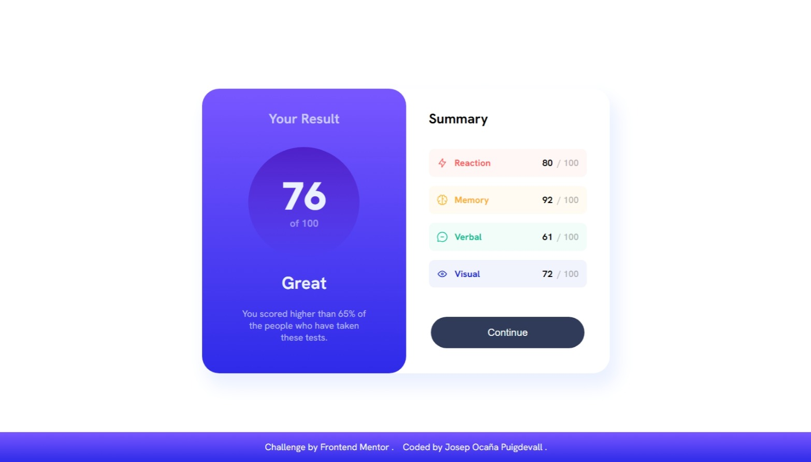
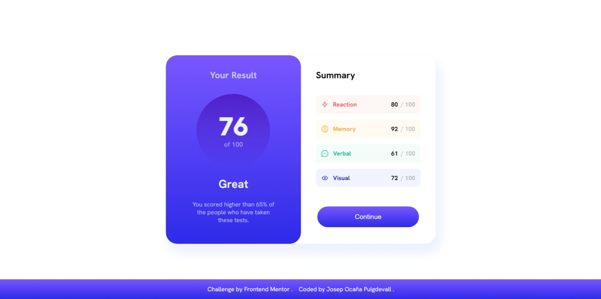
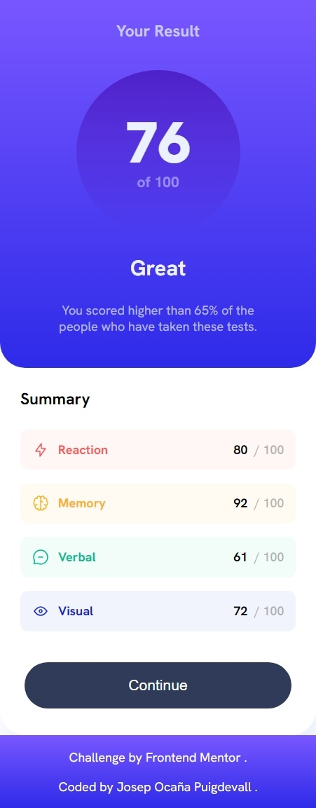

# Frontend Mentor - Results summary component solution

Hi everyone!! 😊

This is a solution to the [Results summary component challenge on Frontend Mentor](https://www.frontendmentor.io/challenges/results-summary-component-CE_K6s0maV). Frontend Mentor challenges help you improve your coding skills by building realistic projects.

## Table of contents

- [Overview](#overview)
  - [The challenge](#the-challenge)
  - [Screenshot](#screenshot)
  - [Links](#links)
- [My process](#my-process)
  - [Built with](#built-with)
  - [What I learned](#what-i-learned)
  - [Continued development](#continued-development)
  - [Useful resources](#useful-resources)
- [Author](#author)
- [Acknowledgments](#acknowledgments)

## Overview

### The challenge

Users should be able to:

- View the optimal layout for the interface depending on their device's screen size
- See hover and focus states for all interactive elements on the page
- **Bonus**: Use the local JSON data to dynamically populate the content

### Screenshot

#### Desktop



#### Active states



#### Mobile design



### Links

- Solution URL: [@Josep-Ocana-results-summary-project](https://github.com/Josep-Ocana/frontendMentor-summary)
- Live Site URL: [@Josep-Ocana-results-summary-page](https://frontendmentor-josep-summary.netlify.app/)

## My process

### Built with

- Semantic HTML5 markup
- Sass
- Flexbox
- Node.js

### What I learned

In this project I've just started to use Sass. It's a powerful tool to make css styles in most efficient way with Less code.

I've worked with node.js and webpack. It has been difficult because is the first time I've worked with both tools in a project. It has been a real challenge to take my project to production and make it work properly.

Some code Sass lines:

```Sass
.row {
	@extend %row;

	&-Reaction {
		@extend %row;
		@extend %row-Reaction;
	}
	&-Memory {
		@extend %row;
		@extend %row-Memory;
	}
    ...
}

```

### Continued development

I realised that I have to improve my Sass skills and node.js and the manner to take my project to production. It has very useful to me to learn it .

### Useful resources

- [chat GPT](https://chatgpt.com) - I use this tool for two reasons: first I find what I am looking for, and second I am learning how use it because it is going to be essential tool in our future.

## Author

- Frontend Mentor - [@Josep-Ocana](https://www.frontendmentor.io/profile/Josep-Ocana)

## Acknowledgments

- I would like to thank frontend mentor for doing these exercises that help us to improve and refine our code.

- I would like to thank web pages that teaching us so much , and all developers who help people become better developers in many web pages like [MDN Web Docs](https://developer.mozilla.org), [Stack Overflow](https://stackoverflow.com/),
  [w3schools.com](https://www.w3schools.com/), etc. Thanks for offering so much support us

- I would also like to thank my family for motivating me and for his support.😘
